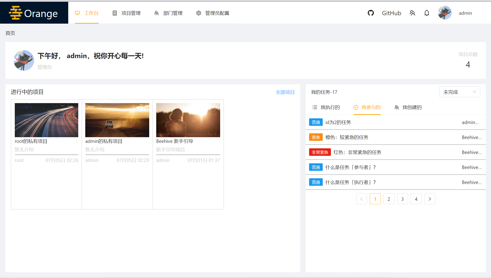
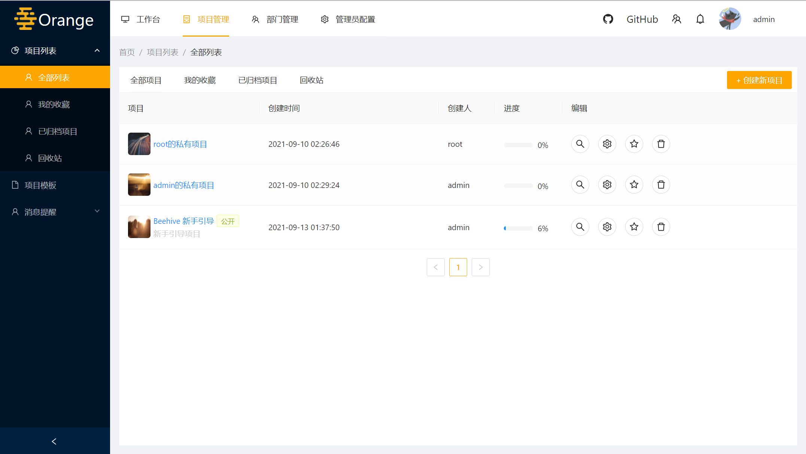
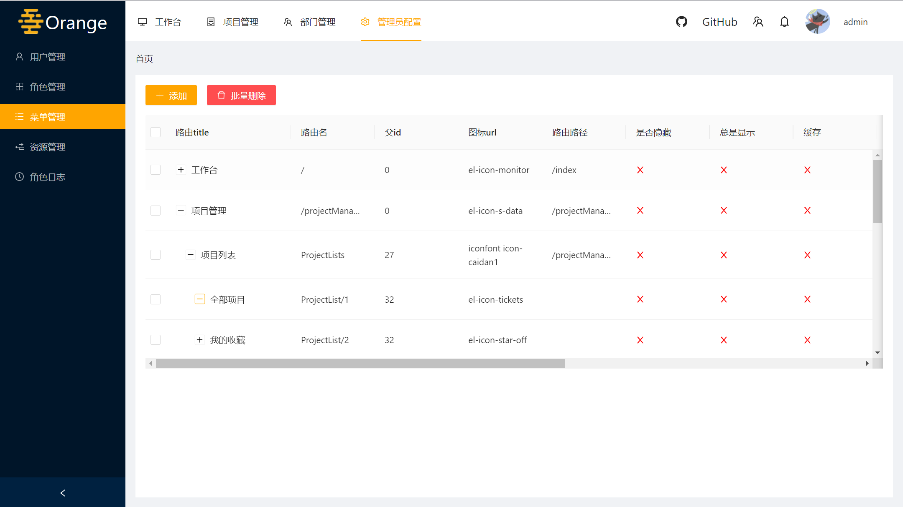
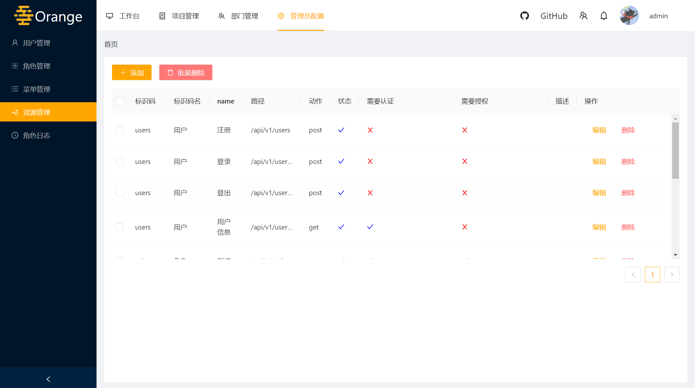
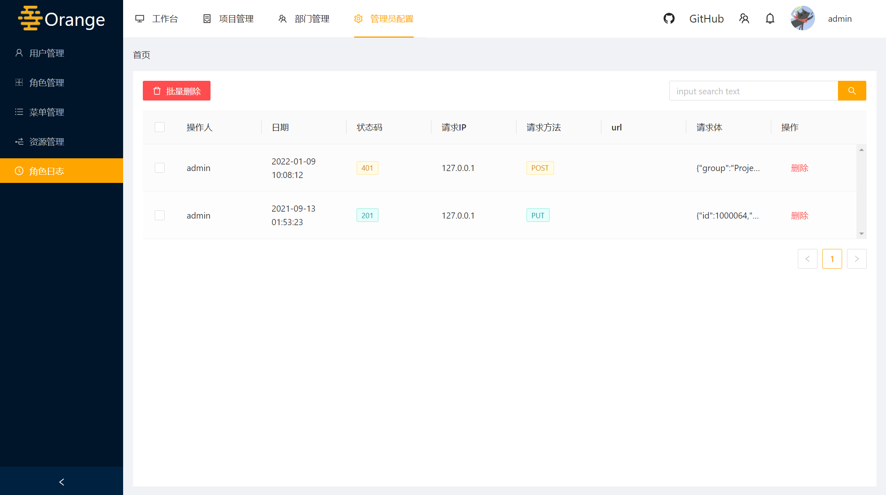
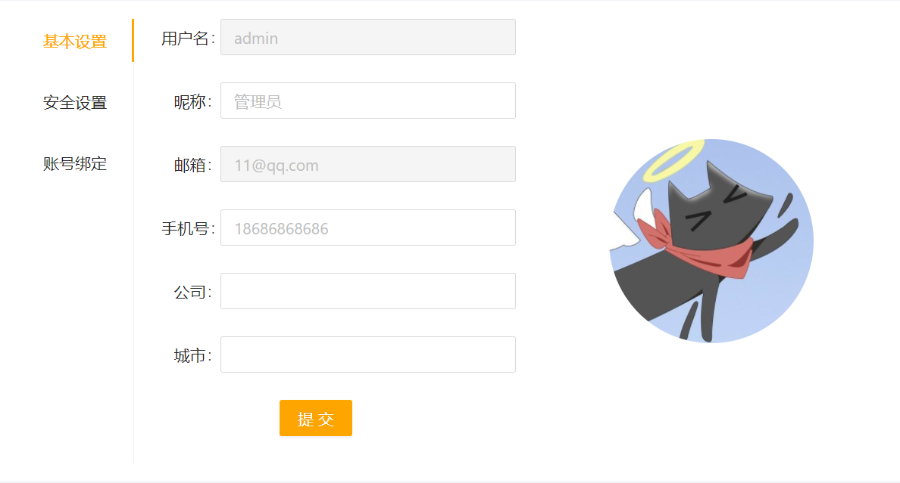
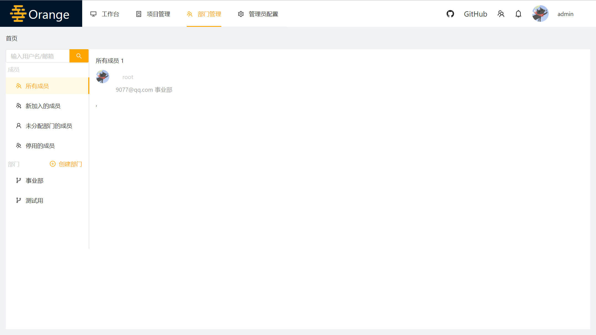

## PC端Orange项目管理系统

### 前言

Orange是一个项目管理系统。参考于Beehive ，实现部分功能。

这是一个React+antd的前端项目，

后端接口使用<a href="https://github.com/Imfdj/egg-beehive.git">Beehive github地址</a>

### 技术栈

react+redux+antd+axios+echarts+nprogress+xlsx

### 安装依赖

```
yarn install
```

### 运行项目

```
yarn start
```

### 项目实现

-  登录、注册 -- 完成

-  找回密码 -- 完成

-  个人设置 -- 完成

-  项目模板 -- 完成

-  工作台 -- 完成

-  用户管理 -- 完成

-  角色管理 -- 完成

-  菜单管理 -- 完成

-  资源管理 -- 完成

-  操作日志 -- 完成

-  动态菜单 -- 完成

-  部门管理 -- 完成

-  项目列表 -- 完成

-  任务看板 -- 完成

-  任务列表 -- 完成

-  项目文件 -- 完成

-  项目设置 -- 完成

-  项目回收站 -- 完成

-  任务筛选 -- 完成

-  任务详情 -- 完成

-  任务标签 -- 完成

-  任务参与者 -- 完成

  ### 部分截图














